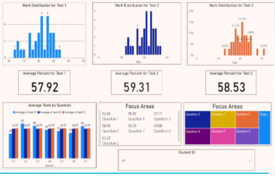

# Scalable Marking Feedback
EXPLORE Incubate project for a Scalable-marking-feedback tool

Teachers are the real superheroes of society but due to time constraints they don't always have enough time to give valuable feedback.

Our solution? Create a scalable marking tool that can provide feedback digitally

### How?

* OCR technology to read hand-written math equations
* Mathematical Language Processing (MLP) to classify the answers
* Export feedback to google sheet

### What will the end product look like?

* Teacher sets up a test and a memo with all the possible answers for each question
* After learners completed the tests, the teacher puts all the scripts through a scanner that will scan all the scripts as one pdf file
* Teacher uploads that one pdf file and the memo as a pdf to our software
* Out comes a spreadsheet with each learner's marks and their feedback
* Teacher can choose to just print the sheet or plot graphs on the sheet

## Labeling

For the OCR technology to identify ticks on a paper we first need to label an exisiting dataset.
We did this through **AWS SageMaker**.
Amazon SageMaker is a cloud machine-learning platform, it enables developers to create, train, and deploy machine-learning models in the cloud.
Using SageMaker we were able to simplify the labeling process greatly, by intuitevly labeling the dataset to get it ready for training.
Below is a walk-through video on how to use **AWS SageMaker Ground Truth** to label a dataset.
[[SageMaker Labeling Walkthrough]](https://www.youtube.com/watch?v=9zGM8FGYhok)

## Output

The output of a SageMaker labeling process in this case was a JSON file.
It is stored in a desired S3 bucket. Once we recieve this output, the dataset is now ready to be trained using the SageMaker training Jobs.
After the data has been trained to identify (and count) the ticks, we then need to Export the feedback to google sheets.

## Feedback

The feedback will be in a dashboard form as well as in google sheets. The dashboard was made with **PowerBI** and gives a overview of both class and individual stats to help the teachers identify focus areas and at risk Students. This will help teachers greatly in both curating their own classrooms to fit what is need most by the students, and to also give an analysis report to anyone (GradeHead/Parent/Principle) that wishes to have kore information.

**Sample of Possible Dashboard**

# Deployment
In the Future once this has had more time in development, we belive that this concept could greatly improve the classroom experience for the teachers and students alike. It will be a very useful tool to help teachers save time and focus on the students and their needs. It will also help parents to get a deeper understanding of their childs/childrens needs and performance in the classroom.

# The Team
* Monica Farrell (Team Lead)
* Keane Byrne
* Hester Stofberg
* Kgaogelo Mamadi
